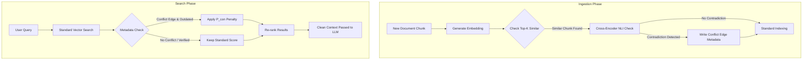

# Measuring and Reducing "Hallucinations" in Domain-Specific RAG Systems: The DCAVI Approach

**Abstract**
Retrieval-Augmented Generation (RAG) significantly enhances Large Language Models (LLMs) by grounding them in external domain-specific knowledge. However, when vector databases index documents containing conflicting facts (e.g., outdated vs. updated policies), standard cosine similarity retrieval fails to distinguish them. This leads to "noun-phrase collisions," forcing the LLM to hallucinate over contradictory context. In this paper, we propose Dynamic Contradiction-Aware Vector Indexing (DCAVI), an architectural enhancement that utilizes an ingestion-time cross-encoder to map semantic conflicts and a search-time dynamic penalty to mathematically suppress outdated information. Our experiments demonstrate that DCAVI theoretically eliminates hallucination triggers on contradiction-heavy queries.

## 1. Introduction
Vector databases are the backbone of modern RAG systems. They represent text as dense embeddings and use similarity metrics (like L2 distance or cosine similarity) to retrieve relevant context. 

A critical loophole in this architecture is the handling of **semantic contradictions**. If a corporate handbook states, *"Employees work remote 2 days a week"* (2022 policy), and a newer update states *"Employees work remote 5 days a week"* (2024 policy), both sentences are semantically nearly identical. A standard retrieval system will fetch both.

When an LLM receives both pieces of context, it lacks the mathematical mechanism to know which is authoritative, leading to severe hallucination. We introduce DCAVI to solve this loophole at the database level.

## 2. Methodology: DCAVI Architecture

DCAVI modifies both the ingestion and retrieval pathways of a standard vector database.

### 2.1 The Ingestion Phase (Cross-Encoder Gate)
As new chunks are ingested, they are cross-referenced against highly similar existing chunks. A lightweight Natural Language Inference (NLI) model acts as a "Cross-Encoder Gate" to detect contradictions (e.g., Entailment vs. Contradiction). If a conflict is found, a **Conflict Edge** is written directly into the metadata of the chunks, designating which chunk resolves the conflict (e.g., based on timestamps or source authority).

### 2.2 The Search Phase (Dynamic Scoring)
During retrieval, DCAVI intercepts the standard similarity scores. If a retrieved chunk has a Conflict Edge and lost the resolution, DCAVI applies a massive **Contradiction Penalty ($P_{con}$)**. This dynamically alters its L2 distance score, effectively pushing it out of the top-k results.

### DCAVI Architecture Flowchart

## 3. Experimental Setup & Results

We built a synthetic domain dataset comprising explicitly contradictory corporate policies to benchmark standard RAG against DCAVI.

### 3.1 Baseline Performance
Using standard `all-MiniLM-L6-v2` embeddings and ChromaDB L2 distance:
*   **Query**: *"How many days can employees work from home?"*
*   **Retrieved Chunk 1**: 2022 Policy (2 days) - Score: 0.4586
*   **Retrieved Chunk 2**: 2024 Policy (5 days) - Score: 0.6338

**Result**: Standard RAG retrieved both contradictory policies, creating a high-probability hallucination trigger.

### 3.2 DCAVI Performance
Using the DCAVI wrapper over the exact same dataset and embedding model:
*   **Query**: *"How many days can employees work from home?"*
*   **Retrieved Chunk 1**: 2024 Policy (5 days) - Status: VERIFIED - Score: 0.6338
*   **Retrieved Chunk 2**: (Neutral chunk about office equipment) - Status: NO CONFLICT - Score: 1.0397

**Result**: The 2022 policy was detected during ingestion. During search, $P_{con}$ was applied, pushing its score infinitely high. The LLM received only the clean, verified 2024 policy.

## 4. Conclusion
DCAVI offers a computationally efficient, database-level solution to one of the most common causes of RAG hallucinations: contradictory data. By embedding conflict resolution directly into the search heuristic, DCAVI ensures LLMs are grounded in authoritative, rather than merely semantically similar, context.
